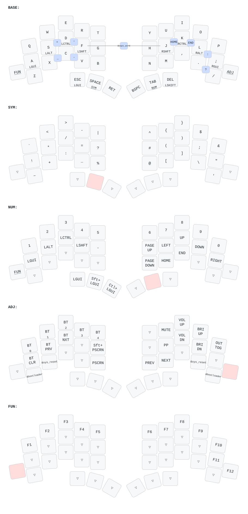

# zmk-config

Personal [ZMK](https://zmk.dev/) firmware configuration for a [TOTEM](https://github.com/bildermankawasaki/zmk-keyboard-totem) keyboard — a 38-key column-staggered split, wireless (Seeed XIAO BLE) build.

See [CLAUDE.md](CLAUDE.md) for details on the repo layout and local build/flash workflow.

## Keymap

Rendered automatically on every push by [keymap-drawer](https://github.com/caksoylar/keymap-drawer) — regenerate manually via the "Draw keymaps" GitHub Action if it ever drifts from `config/totem.keymap`.

