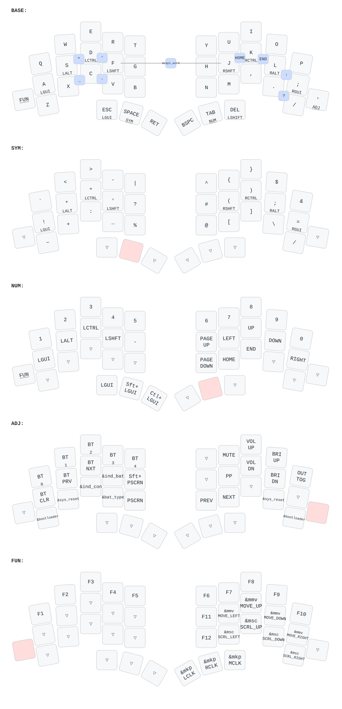
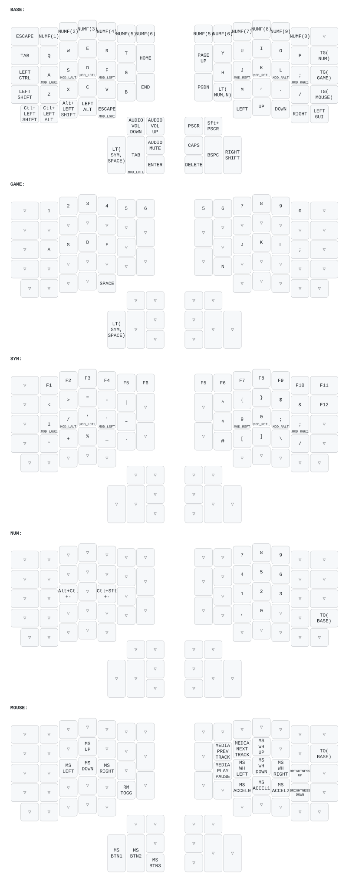

# zmk-config

Personal firmware config for two keyboards: a [TOTEM](https://github.com/bildermankawasaki/zmk-keyboard-totem) — a 38-key column-staggered split, wireless (Seeed XIAO BLE) build on [ZMK](https://zmk.dev/) — and an ErgoDox EZ Glow on QMK. The ErgoDox runs its own layout (derived from an Oryx layout), sharing only the TOTEM's home-row mods and combos.

See [AGENTS.md](AGENTS.md) for details on the repo layout and local build/flash workflow.

## TOTEM keymap

Rendered automatically on every push by [keymap-drawer](https://github.com/caksoylar/keymap-drawer) — regenerate manually via the "Draw keymaps" GitHub Action if it ever drifts from `config/totem.keymap`.

## ErgoDox EZ keymap

Rendered automatically on every push by the "Draw ErgoDox keymap" GitHub Action — regenerate manually via that Action if it ever drifts from `qmk/ergodox_ez/keymap.c`.

